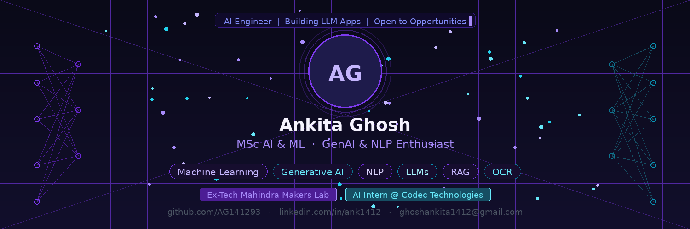

# 👋 Hi, I'm Ankita Ghosh

  

---

## 🚀 About Me

🎓 M.Sc. in Artificial Intelligence & Machine Learning (CGPA: 9.3)
💼 Ex-ML Intern @ Tech Mahindra Makers Lab
🤖 GenAI & NLP Engineer

I build **production-ready AI systems**, not just models.

💡 Focus Areas:

* RAG Systems & LLM Pipelines
* Multilingual NLP (Indian Languages)
* Synthetic Data Generation (10× scaling)
* Document Intelligence & OCR

---

## 🌍 Open Source Contributions

* 🚀 Opened PR to **canonical/pycloudlib**
* 📄 Added `CONTRIBUTING.md` (documentation improvement)
* 🟢 Actively contributing to beginner-friendly issues

---

## 🏆 GitHub Achievements

  

---

## 📊 GitHub Stats

  
  

  

---

## ⚡ Contribution Activity

---

## 🛠 Tech Stack

### 💻 Languages

---

### 🤖 GenAI / LLM

---

### ☁️ Tools & MLOps

---

## 💼 Experience

### 🧠 Machine Learning Intern — Tech Mahindra Makers Lab

* Built multilingual NLP pipelines (10,000+ dialect variations)
* Developed ASR systems with WER evaluation
* Designed automated annotation pipelines using NVIDIA NIM
* Built real-time translation systems

---

## 🚀 Featured Work

* 🔹 LLM Q&A Generation System
* 🔹 Intelligent RAG Pipeline
* 🔹 Vision-Language Model (OCR + LLM)
* 🔹 Forecasting & ML Projects

---

## 🤝 Connect With Me

🔗 LinkedIn: https://www.linkedin.com/in/ank1412
💻 GitHub: https://github.com/AG141293
🤗 HuggingFace: https://huggingface.co/AnkGhosh
📧 Email: [ghoshankita1412@gmail.com](mailto:ghoshankita1412@gmail.com)

---

## 🎯 2026 Goals

* Contribute to top open-source AI projects
* Build scalable GenAI systems
* Strengthen MLOps & system design
* Land a high-impact AI/ML role 🚀

---

⭐ *Building AI systems that actually work in the real world*

